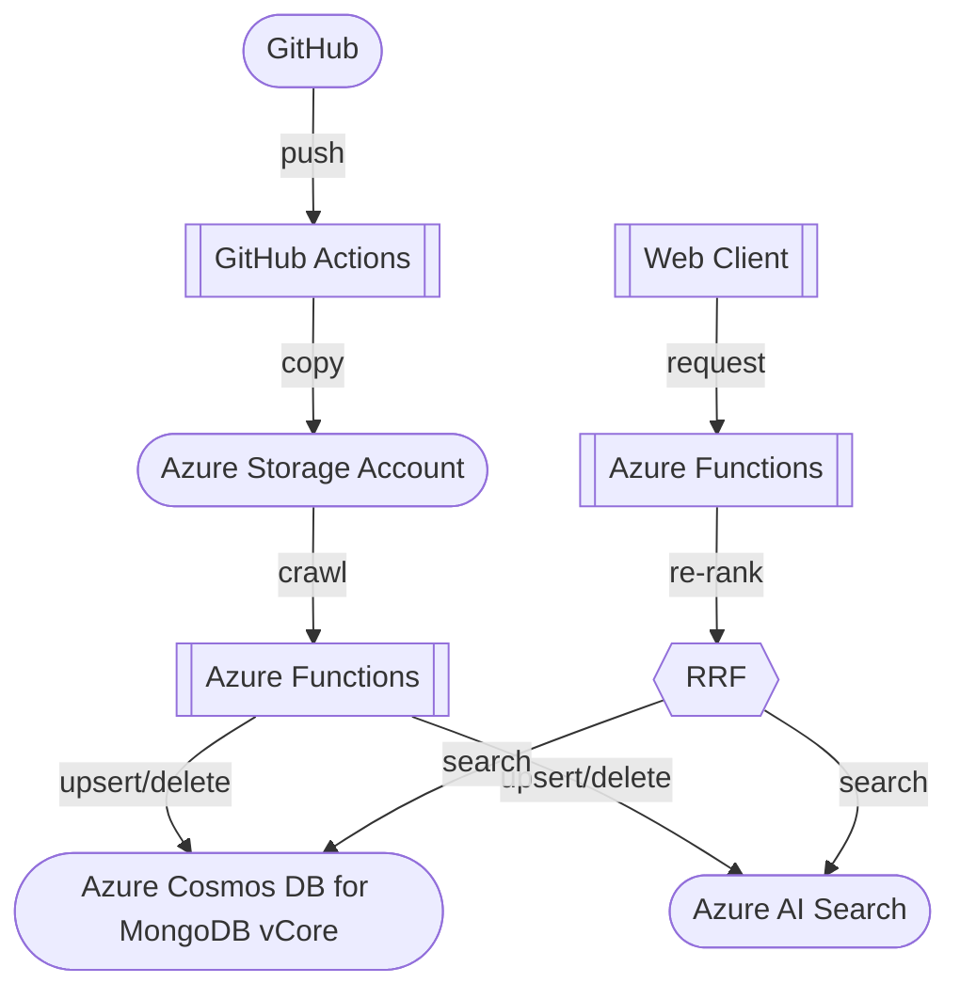

# からめもぶろぐ。記事検索

Azure AI Search および Azure Cosmos DB for MongoDB vCore を使ってベクター検索をするサンプルです。

- [Azure AI Search でベクトル クエリを作成する](https://learn.microsoft.com/ja-jp/azure/search/vector-search-how-to-create-index)
- [Azure Cosmos DB for MongoDB 仮想コアの埋め込みでベクター検索を使用する](https://learn.microsoft.com/ja-jp/azure/cosmos-db/mongodb/vcore/vector-search)

Azure では Azure AI Search を使用してベクター検索を実装することが一般的ですが、Azure Cosmos DB for MongoDB vCore を使用することで、よりスケーラブルにすることが可能です。

## アーキテクチャ

